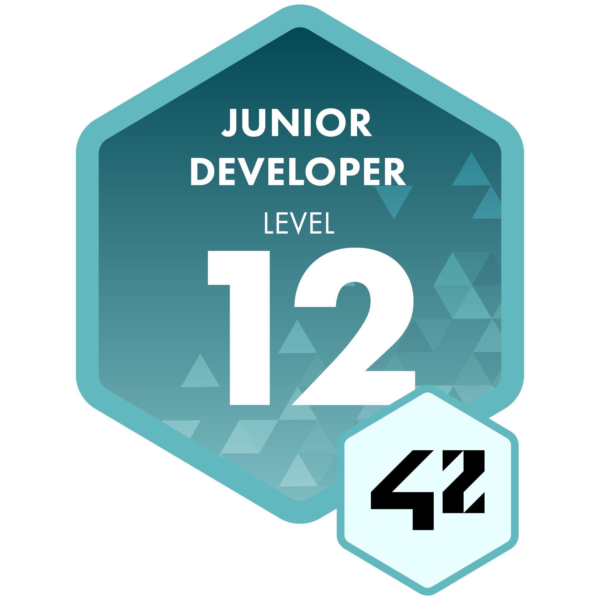

  

  Student at 42 Angoulême

<h2>Ongoing Projects</h2>

<h2>Projects</h2>
<table>
  <thead>
    <tr>
      <td></td>
      <td><b>Name</b></td>
      <td><b>Note</b></td>
    </tr>
  </thead>
  <tbody>
    <tr><td>🚧</td><td>internship I - Company Final Evaluation</td><td></td></tr>
    <tr><td>✅</td><td>internship I - Company Mid Evaluation</td><td></td></tr>
    <tr><td>✅</td><td>Internship I - Duration</td><td></td></tr>
    <tr><td>✅</td><td>internship I - Contract Upload</td><td></td></tr>
    <tr><td>🚧</td><td>Internship I</td><td></td></tr>
    <tr><td>🚧</td><td>lem-ipc</td><td></td></tr>
    <tr><td>✅</td><td>malloc</td><td></td></tr>
    <tr><td>✅</td><td>nm</td><td></td></tr>
    <tr><td>✅</td><td>ft_ls</td><td></td></tr>
    <tr><td>✅</td><td>ft_transcendence</td><td></td></tr>
    <tr><td>✅</td><td>webserv</td><td></td></tr>
    <tr><td>✅</td><td>Inception</td><td></td></tr>
    <tr><td>✅</td><td>CPP Module 09</td><td></td></tr>
    <tr><td>✅</td><td>CPP Module 08</td><td></td></tr>
    <tr><td>✅</td><td>CPP Module 07</td><td></td></tr>
    <tr><td>✅</td><td>CPP Module 06</td><td></td></tr>
    <tr><td>✅</td><td>CPP Module 05</td><td></td></tr>
    <tr><td>✅</td><td>CPP Module 04</td><td></td></tr>
    <tr><td>✅</td><td>CPP Module 03</td><td></td></tr>
    <tr><td>✅</td><td>CPP Module 02</td><td></td></tr>
    <tr><td>✅</td><td>CPP Module 01</td><td></td></tr>
    <tr><td>✅</td><td>CPP Module 00</td><td></td></tr>
    <tr><td>✅</td><td>NetPractice</td><td></td></tr>
    <tr><td>✅</td><td>miniRT</td><td></td></tr>
    <tr><td>✅</td><td>Philosophers</td><td></td></tr>
    <tr><td>✅</td><td>minishell</td><td></td></tr>
    <tr><td>✅</td><td>minitalk</td><td></td></tr>
    <tr><td>✅</td><td>push_swap</td><td></td></tr>
    <tr><td>✅</td><td>FdF</td><td></td></tr>
    <tr><td>✅</td><td>Born2beroot</td><td></td></tr>
    <tr><td>✅</td><td>get_next_line</td><td></td></tr>
    <tr><td>✅</td><td>ft_printf</td><td></td></tr>
    <tr><td>✅</td><td>Libft</td><td></td></tr>
  </tbody>
</table>

<h2>Badges</h2>

  
  
  

